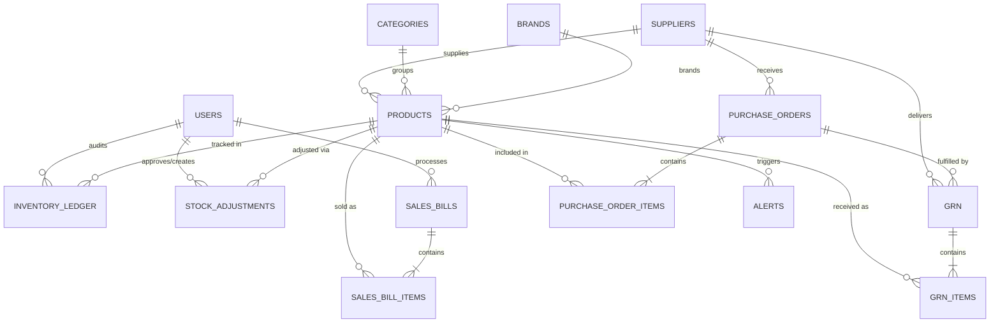

# StockSense ERP - Database Schema Design

Based on the frontend data models and architecture of the StockSense project, here is a comprehensive, normalized Relational Database Schema (suitable for PostgreSQL or MySQL) designed to support the entire ERP workflow securely and efficiently.

## Entity-Relationship Diagram (ERD)

---

## 1. Core Master Data

### `users`
Manages system access and role-based permissions.
* `id` (UUID, Primary Key)
* `name` (VARCHAR)
* `email` (VARCHAR, Unique)
* `password_hash` (VARCHAR)
* `role` (ENUM: `ADMIN`, `INVENTORY_MANAGER`, `CASHIER`)
* `phone` (VARCHAR)
* `avatar_url` (VARCHAR, Nullable)
* `created_at` (TIMESTAMP)
* `updated_at` (TIMESTAMP)

### `suppliers`
Vendor registry for procurement.
* `id` (UUID, Primary Key)
* `name` (VARCHAR)
* `contact_person` (VARCHAR)
* `email` (VARCHAR)
* `phone` (VARCHAR)
* `address` (TEXT)
* `status` (ENUM: `Active`, `Inactive`)
* `rating` (FLOAT)
* `created_at` (TIMESTAMP)

### `categories` & `brands`
Taxonomies for the product catalog.
* `id` (UUID, Primary Key)
* `name` (VARCHAR, Unique)
* `description` (TEXT, Nullable)

### `products`
The core catalog item.
* `id` (UUID, Primary Key)
* `sku` (VARCHAR, Unique)
* `barcode` (VARCHAR, Unique)
* `name` (VARCHAR)
* `category_id` (UUID, Foreign Key)
* `brand_id` (UUID, Foreign Key)
* `supplier_id` (UUID, Foreign Key)
* `unit_type` (VARCHAR)
* `cost_price` (DECIMAL)
* `selling_price` (DECIMAL)
* `stock` (INTEGER)
* `reorder_level` (INTEGER)
* `target_capacity` (INTEGER)
* `mfg_date` (DATE, Nullable)
* `expiry_date` (DATE, Nullable)
* `status` (ENUM: `Active`, `Inactive`, `Discontinued`)
* `image_url` (VARCHAR)
* `created_at` (TIMESTAMP)

---

## 2. Procurement & Receiving

### `purchase_orders`
Tracks orders sent to suppliers.
* `id` (UUID, Primary Key)
* `po_number` (VARCHAR, Unique)
* `supplier_id` (UUID, Foreign Key)
* `order_date` (TIMESTAMP)
* `expected_delivery_date` (DATE)
* `status` (ENUM: `Pending`, `Received`, `Cancelled`)
* `total_amount` (DECIMAL)

### `purchase_order_items`
* `id` (UUID, Primary Key)
* `po_id` (UUID, Foreign Key)
* `product_id` (UUID, Foreign Key)
* `ordered_qty` (INTEGER)
* `unit_cost` (DECIMAL)

### `goods_receiving_notes` (GRN)
Tracks actual physical inventory received.
* `id` (UUID, Primary Key)
* `grn_number` (VARCHAR, Unique)
* `po_id` (UUID, Foreign Key, Nullable)
* `supplier_id` (UUID, Foreign Key)
* `received_date` (TIMESTAMP)
* `total_quantity` (INTEGER)
* `total_cost` (DECIMAL)
* `status` (ENUM: `Completed`, `Shortage`, `Over Delivery`)
* `accuracy_score` (INTEGER)
* `notes` (TEXT, Nullable)

### `grn_items`
* `id` (UUID, Primary Key)
* `grn_id` (UUID, Foreign Key)
* `product_id` (UUID, Foreign Key)
* `ordered_qty` (INTEGER)
* `received_qty` (INTEGER)
* `unit_cost` (DECIMAL)
* `mfg_date` (DATE, Nullable)
* `expiry_date` (DATE, Nullable)

---

## 3. Inventory Operations

### `inventory_ledger`
The immutable audit trail of ALL stock movements (Critical for ERP).
* `id` (UUID, Primary Key)
* `product_id` (UUID, Foreign Key)
* `movement_type` (ENUM: `GRN`, `Sale`, `Adjustment`, `Expiry Removal`, `Supplier Return`)
* `quantity_change` (INTEGER, Positive or Negative)
* `before_stock` (INTEGER)
* `after_stock` (INTEGER)
* `reason` (VARCHAR)
* `user_id` (UUID, Foreign Key)
* `timestamp` (TIMESTAMP)
* `status` (ENUM: `Success`, `Warning`, `Critical`)

### `stock_adjustments`
Manual corrections requiring approval.
* `id` (UUID, Primary Key)
* `adjustment_number` (VARCHAR, Unique)
* `product_id` (UUID, Foreign Key)
* `qty_changed` (INTEGER)
* `reason` (ENUM: `Damaged`, `Lost`, `Expired`, `Returned`, `Counting error`, `System correction`)
* `adjusted_by` (UUID, Foreign Key)
* `status` (ENUM: `Approved`, `Pending`, `Needs Review`)
* `created_at` (TIMESTAMP)

---

## 4. Point of Sale (POS)

### `sales_bills`
* `id` (UUID, Primary Key)
* `bill_number` (VARCHAR, Unique)
* `cashier_id` (UUID, Foreign Key)
* `subtotal` (DECIMAL)
* `discount` (DECIMAL)
* `tax` (DECIMAL)
* `total` (DECIMAL)
* `payment_method` (ENUM: `CASH`, `CARD`, `ONLINE`)
* `created_at` (TIMESTAMP)

### `sales_bill_items`
* `id` (UUID, Primary Key)
* `bill_id` (UUID, Foreign Key)
* `product_id` (UUID, Foreign Key)
* `qty` (INTEGER)
* `unit_price` (DECIMAL)

---

## 5. System Config & Intelligence

### `alerts`
Tracks active and historical notifications generated by the rule engine.
* `id` (UUID, Primary Key)
* `type` (ENUM: `LOW_STOCK`, `EXPIRY`, `DEAD_STOCK`, `FAST_MOVING`)
* `product_id` (UUID, Foreign Key)
* `title` (VARCHAR)
* `message` (TEXT)
* `severity` (ENUM: `INFO`, `WARNING`, `CRITICAL`)
* `status` (ENUM: `ACTIVE`, `RESOLVED`, `DISMISSED`)
* `created_at` (TIMESTAMP)

### `system_settings`
Global configuration settings (like global alert thresholds).
* `id` (UUID, Primary Key)
* `key` (VARCHAR, Unique)  // e.g., 'low_stock_percentage_threshold'
* `value` (JSONB)
* `updated_at` (TIMESTAMP)
